# Exclusion Rules to Snowflake Query Mapping

```mermaid
flowchart TD
    subgraph "COF System ID Exclusion Rules"
        R1["Identity UserType Check"]
        R2["Exclusion Population Check"]
        R3["Base Role Exclusion"]
        R4["Custom Role Exclusion"]
        R5["Team Site/Role Exclusion"]
        R6["Duplicate Role Exclusion"]
        R7["Child Role Exclusion"]
        R8["Application Exclusions"]
        R9["Disabled Account Exclusions"]
        R10["Account Only Exclusions"]
        R11["Quarterly Frequency Check"]
        R12["AD Empty Account Check"]
        R13["Disabled Entitlement Check"]
        R14["Related App Exclusions"]
        R15["AD Non-Requestable Check"]
        R16["Entitlement Exclusions"]
    end

    subgraph "Snowflake Query Implementation"
        Q1["WHERE i.cof_account_type = 'System'<br/>AND i.cof_managed_by IS NOT NULL"]
        Q2["FROM exclusion_rules er<br/>WHERE er.type = 'cofCertificationExclusionPopulation'"]
        Q3["FROM identityiq.spt_bundle b<br/>WHERE b.type = 'base'"]
        Q4["FROM exclusion_rules er<br/>WHERE er.type = 'rolesToBeExcluded'"]
        Q5["FROM identityiq.spt_bundle b<br/>WHERE b.name LIKE '%_TEAM_SITE%'<br/>OR b.name LIKE '%_TEAM_ROLE%'"]
        Q6["Handled by DISTINCT and matching logic"]
        Q7["WHERE ie2.name = 'assignedRoles'<br/>AND ie2.value = sa.value"]
        Q8["FROM exclusion_rules er<br/>WHERE er.type = 'applicationsToBeExcluded'"]
        Q9["WHERE er.type = 'disabledAccountApplicationsToBeExcluded'<br/>AND l.iiq_disabled = '1'"]
        Q10["WHERE er.type = 'accountOnlyApplicationstobeExcluded'"]
        Q11["WHERE a.cof_app_certification_freq != 'Quarterly'"]
        Q12["WHERE sa.application = 'Active Directory'<br/>AND sa.value IS NULL"]
        Q13["WHERE l2.iiq_disabled = '1'"]
        Q14["Uses ma.cof_ent_related_application"]
        Q15["WHERE ma.requestable IS NULL OR ma.requestable = 0"]
        Q16["WHERE er.type = 'entitlementsToBeExcluded'"]
    end

    subgraph "Special Case Implementations"
        S1["AWS Connect Security Profiles:<br/>sa.application = 'AWS Connect - Card_CDE-East'<br/>AND sa.attribute = 'SecurityProfileNames'"]
        S2["AWS IAM without Native Identity:<br/>sa.application = 'AWS IAM User/Role Request'<br/>AND sa.native_identity IS NULL"]
        S3["Resource Mailbox Exclusion:<br/>l.native_identity NOT LIKE '%OU=Resource Mailboxes%'"]
    end

    R1 --> Q1
    R2 --> Q2
    R3 --> Q3
    R4 --> Q4
    R5 --> Q5
    R6 --> Q6
    R7 --> Q7
    R8 --> Q8
    R9 --> Q9
    R10 --> Q10
    R11 --> Q11
    R12 --> Q12
    R13 --> Q13
    R14 --> Q14
    R15 --> Q15
    R16 --> Q16

    Q1 --> S3
    Q16 --> S1
    Q16 --> S2

    style R1 fill:#f9f,stroke:#333,stroke-width:2px
    style R3 fill:#bbf,stroke:#333,stroke-width:2px
    style R5 fill:#bbf,stroke:#333,stroke-width:2px
    style R8 fill:#fbb,stroke:#333,stroke-width:2px
    style R11 fill:#fbb,stroke:#333,stroke-width:2px
```

## Legend
- **Pink**: Identity-level exclusions
- **Blue**: Role/Bundle exclusions  
- **Red**: Application/Account exclusions
- **White**: Entitlement exclusions