# Oracle PL/SQL to Snowflake Query Mapping

```mermaid
flowchart TD
    subgraph "Oracle PL/SQL Components"
        O1["DECLARE Variables:<br/>v_cert_tag, v_expected_result,<br/>v_reason, record_cnt"]
        O2["FOR input_data IN<br/>(System accounts loop)"]
        O3["FOR second_data IN<br/>(Complex JOIN query)"]
        O4["Procedural IF/ELSIF logic<br/>with GOTO statements"]
        O5["INSERT INTO PENDING_CERT_REVOKE4"]
        O6["UPDATE REVOKE_IDS tracking"]
        O7["COMMIT after each record"]
        O8["dbms_output.put_line()"]
        O9["Oracle (+) outer join syntax"]
        O10["REGEXP_LIKE for patterns"]
        O11["SYSDATE for timestamps"]
    end

    subgraph "Snowflake SQL Components"
        S1["WITH certification_config AS<br/>(CTE for variables)"]
        S2["system_accounts CTE<br/>(Replaces first loop)"]
        S3["validation_results CTE<br/>(Replaces second loop)"]
        S4["Nested CASE statements<br/>(Replaces IF/ELSIF/GOTO)"]
        S5["SELECT with WHERE filter<br/>(Replaces INSERT logic)"]
        S6["No tracking updates<br/>(Query-only approach)"]
        S7["Result set output<br/>(No commits needed)"]
        S8["Direct SELECT output"]
        S9["Standard LEFT JOIN syntax"]
        S10["LIKE patterns<br/>(No regex needed)"]
        S11["CURRENT_TIMESTAMP()"]
    end

    subgraph "Key Transformations"
        T1["Loops → CTEs"]
        T2["Variables → CTE columns"]
        T3["GOTO → CASE expressions"]
        T4["Row-by-row → Set-based"]
        T5["Procedural → Declarative"]
    end

    O1 --> S1
    O2 --> S2
    O3 --> S3
    O4 --> S4
    O5 --> S5
    O6 --> S6
    O7 --> S7
    O8 --> S8
    O9 --> S9
    O10 --> S10
    O11 --> S11

    O1 --> T2
    O2 --> T1
    O3 --> T1
    O4 --> T3
    O2 --> T4
    O3 --> T4
    O4 --> T5

    style O1 fill:#faa,stroke:#333,stroke-width:2px
    style O2 fill:#faa,stroke:#333,stroke-width:2px
    style O3 fill:#faa,stroke:#333,stroke-width:2px
    style O4 fill:#faa,stroke:#333,stroke-width:2px
    style S1 fill:#afa,stroke:#333,stroke-width:2px
    style S2 fill:#afa,stroke:#333,stroke-width:2px
    style S3 fill:#afa,stroke:#333,stroke-width:2px
    style S4 fill:#afa,stroke:#333,stroke-width:2px
    style T1 fill:#ffa,stroke:#333,stroke-width:2px
    style T2 fill:#ffa,stroke:#333,stroke-width:2px
    style T3 fill:#ffa,stroke:#333,stroke-width:2px
    style T4 fill:#ffa,stroke:#333,stroke-width:2px
    style T5 fill:#ffa,stroke:#333,stroke-width:2px

```

## Mapping Details

### Data Flow Comparison
| Oracle PL/SQL | Snowflake SQL |
|---------------|---------------|
| Loop through each EID | All EIDs processed in parallel |
| Loop through entitlements | JOIN operations handle relationships |
| Track progress with counters | No counters needed |
| Update tracking tables | Query-only, no side effects |
| Output via dbms_output | Standard result set |

### Business Logic Preservation
- All exclusion rules maintained exactly
- Same joining logic between tables
- Identical CASE conditions
- Same output structure (item_type, eid, application, etc.)