# Snowflake Query Schema Validation - All Columns Used

```mermaid
erDiagram
    SPT_IDENTITY {
        varchar name "EID - Employee/Entity ID"
        varchar cof_account_type "Must equal 'System'"
        varchar cof_managed_by "Must NOT be NULL"
        varchar id "Primary key for joins"
    }

    SPT_LINK {
        varchar identity_id "FK to spt_identity"
        varchar application "FK to spt_application"
        varchar native_identity "Username in target system"
        varchar display_name "Display name"
        timestamp created "Creation date"
        char iiq_disabled "0=enabled, 1=disabled"
    }

    SPT_APPLICATION {
        varchar id "Primary key"
        varchar name "Application name"
        varchar cof_app_certification_freq "Must check for 'Quarterly'"
    }

    SPT_IDENTITY_ENTITLEMENT {
        varchar identity_id "FK to spt_identity"
        varchar application "FK to spt_application"
        varchar native_identity "Matches spt_link"
        varchar name "attribute - assignedRoles/detectedRoles/etc"
        varchar value "Role/permission value"
    }

    SPT_BUNDLE {
        varchar name "Bundle/role name"
        varchar type "base/it/business"
        varchar id "Primary key"
    }

    SPT_BUNDLE_REQUIREMENTS {
        varchar bundle "Parent bundle ID"
        varchar child "Child bundle ID"
    }

    SPT_MANAGED_ATTRIBUTE {
        varchar value "Entitlement value"
        varchar attribute "Attribute name"
        varchar display_name "Display name"
        integer requestable "0/1 flag"
        varchar cof_ent_related_application "Related app"
        varchar application "FK to spt_application"
    }

    SPT_CERTIFICATION {
        varchar id "Certification ID"
        varchar name "Certification name"
    }

    SPT_CERTIFICATION_ENTITY {
        varchar certification_id "FK to spt_certification"
        varchar target_name "EID being certified"
        varchar id "Entity ID"
    }

    SPT_CERTIFICATION_ITEM {
        varchar id "Item ID"
        varchar certification_entity_id "FK to spt_certification_entity"
        varchar type "Account/Bundle/Exception"
        varchar sub_type "For bundle subtypes"
        varchar exception_application "Application name"
        varchar exception_attribute_name "Attribute"
        varchar exception_attribute_value "Value"
        varchar bundle "Bundle name"
        varchar exception_entitlements "FK to snapshot"
    }

    SPT_ENTITLEMENT_SNAPSHOT {
        varchar id "Snapshot ID"
        varchar native_identity "Account name"
    }

    SPT_ARCHIVED_CERT_ENTITY {
        varchar certification_id "FK to spt_certification"
        varchar target_name "EID"
        varchar id "Archived entity ID"
    }

    SPT_ARCHIVED_CERT_ITEM {
        varchar id "Archived item ID"
        varchar parent_id "FK to archived entity"
        varchar type "Account/Bundle/Exception"
        varchar sub_type "For bundle subtypes"
        varchar exception_application "Application"
        varchar exception_native_identity "Native ID"
        varchar exception_attribute_name "Attribute"
        varchar exception_attribute_value "Value"
        varchar bundle "Bundle name"
    }

    SPT_CERTIFICATION_TAGS {
        varchar certification_id "FK to spt_certification"
        varchar elt "FK to spt_tag"
    }

    SPT_TAG {
        varchar id "Tag ID"
        varchar name "Tag name (e.g. '2025_Q2_SYSCERT')"
    }

    CERTIFICATION_EXCLUSION {
        varchar type "Rule type key"
        varchar application "Application name"
        varchar attribute "Attribute name"
        varchar value "Value to exclude"
        varchar certification_type "Must equal 'SystemId_Q2'"
    }

    SPT_IDENTITY ||--o{ SPT_LINK : "has accounts"
    SPT_APPLICATION ||--o{ SPT_LINK : "contains accounts"
    SPT_IDENTITY ||--o{ SPT_IDENTITY_ENTITLEMENT : "has entitlements"
    SPT_APPLICATION ||--o{ SPT_IDENTITY_ENTITLEMENT : "provides entitlements"
    SPT_APPLICATION ||--o{ SPT_MANAGED_ATTRIBUTE : "defines attributes"
    SPT_BUNDLE ||--o{ SPT_BUNDLE_REQUIREMENTS : "parent of"
    SPT_BUNDLE ||--o{ SPT_BUNDLE_REQUIREMENTS : "child of"
    SPT_CERTIFICATION ||--o{ SPT_CERTIFICATION_ENTITY : "certifies"
    SPT_CERTIFICATION_ENTITY ||--o{ SPT_CERTIFICATION_ITEM : "contains items"
    SPT_CERTIFICATION_ITEM ||--o{ SPT_ENTITLEMENT_SNAPSHOT : "snapshots"
    SPT_CERTIFICATION ||--o{ SPT_ARCHIVED_CERT_ENTITY : "archives"
    SPT_ARCHIVED_CERT_ENTITY ||--o{ SPT_ARCHIVED_CERT_ITEM : "contains"
    SPT_CERTIFICATION ||--o{ SPT_CERTIFICATION_TAGS : "tagged with"
    SPT_CERTIFICATION_TAGS ||--o{ SPT_TAG : "references"
```

## Critical Columns by Table

### Identity Tables
- **spt_identity**: name, cof_account_type, cof_managed_by, id
- **spt_link**: identity_id, application, native_identity, display_name, created, iiq_disabled
- **spt_application**: id, name, cof_app_certification_freq

### Entitlement Tables  
- **spt_identity_entitlement**: identity_id, application, native_identity, name, value
- **spt_bundle**: name, type, id
- **spt_bundle_requirements**: bundle, child
- **spt_managed_attribute**: value, attribute, display_name, requestable, cof_ent_related_application, application

### Certification Tables
- **spt_certification**: id, name
- **spt_certification_entity**: certification_id, target_name, id
- **spt_certification_item**: All columns listed
- **spt_entitlement_snapshot**: id, native_identity
- **spt_archived_cert_entity**: certification_id, target_name, id
- **spt_archived_cert_item**: All columns listed
- **spt_certification_tags**: certification_id, elt
- **spt_tag**: id, name

### Custom Table
- **certification_exclusion**: type, application, attribute, value, certification_type